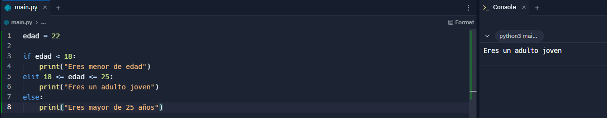

# Documentación Python Básico para Nuevos Desarrolladores

Esta guía está diseñada para ayudar a los nuevos desarrolladores a comprender algunos de los conceptos fundamentales de Python. Cada sección incluye explicaciones, ejemplos y sintaxis clara para facilitar el aprendizaje.

---

## ¿Qué es un condicional?

Un **condicional** permite que un programa tome decisiones basadas en las condiciones que el desarrolador decida. En Python usamos `if`, `elif` y `else` para ejecutar diferentes bloques de código según se cumplan o no dichas condiciones.

### Sintaxis básica:

```python
if condición:
    # Código si la condición es verdadera
elif otra_condición:
    # Código si la otra condición es verdadera
else:
    # Código si ninguna condición es verdadera
```

### Ejemplo:

```python
edad = 22

if edad < 18:
    print("Eres menor de edad")
elif 18 <= edad <= 25:
    print("Eres un adulto joven")
else:
    print("Eres mayor de 25 años")
```

#### Ejemplo gráfico del condicional


---

## ¿Cuáles son los diferentes tipos de bucles en Python? ¿Por qué son útiles?

Los **bucles** permiten repetir bloques de código sin necesidad de escribir el mismo código repetidamente. En Python, los más comunes son:

### 1. `for`

```python
numeros = [0, 1, 2, 3, 4]

for i in numeros:
    print(i)
```

#### Ejemplo gráfico de bucle for


### 2. `while`

```python
x = 0
while x < 5:
    print(x)
    x += 1
```

#### Ejemplo gráfico de bucle while


### ¿Por qué son útiles?

Los bucles permiten automatizar tareas repetitivas. Algunos ejemplos de uso son:

### 1. Recorrer todos los elementos de una lista:

```python
personajes = ["Verso", "Maelle", "Monoco", "Lune"]

for personaje in personajes:
    print("Personaje:", personaje)
```

#### Ejemplo gráfico de recorrer los elementos de una lista


### 2. Buscar valores específicos dentro de datos:

```python
numeros = [3, 4, 33, 67, 100]

for numero in numeros:
    if numero == 33:
        print("Número encontrado:", numero)
```

#### Ejemplo gráfico de busqueda de valores especificos


### 3. Aplicar una operación a muchos datos sin tener que escribirla varias veces:

```python
precios = [33, 67, 100]
precios_con_iva = []

for precio in precios:
    precios_con_iva.append(precio * 1.21)

print(precios_con_iva)
```

#### Ejemplo gráfico de operaciones sin muchos datos


### 4. Simular procesos que ocurren de forma continua o que dependen de una condición externa:

```python
energia = 9

while energia > 0:
    print("Energía restante:", energia)
    energia -= 1
```

#### Ejemplo gráfico de simulación de procesos


---

## ¿Qué es una lista por comprensión en Python?

Una **lista por comprensión** es una forma breve de construir listas a partir de otras listas, usando una sola línea de código. Pueden llevar una cpndición o no.

### Sintaxis:

```python
nueva_lista = [expresión for elemento in colección if condición]
```

### Ejemplo de una lista por comprensión sin condición:

```python
cuadrados = [x * x for x in [0, 1, 2, 3, 4, 5, 6, 7, 8, 9]]
print(cuadrados)
```

#### Ejemplo gráfico de lista por comprensión


### Ejemplo de una lista por comprensión con condición:

```python
cuadrados = [x * x for x in [0, 1, 2, 3, 4, 5, 6, 7, 8, 9] if x <= 4]
print(cuadrados)
```

#### Ejemplo gráfico de lista por comprensión con condicion


---

## ¿Qué es un argumento en Python?

Un **argumento** es un valor (pueden ser numeros, strings... dependiendo de la función) que se pasa a una función cuando la llamamos. Las funciones pueden recibir argumentos para despues ejecutar el codigo que tengan programado.

### Ejemplo:

```python
def saludar(nombre):
    print("Hola, " + nombre)

saludar("Verso")  
```

#### Ejemplo gráfico de función con argumento


### Argumentos con valor por defecto:

```python
def saludar(nombre="me alegro de verte"):
    print("Hola, " + nombre)

saludar()         
saludar("Verso")  
```

#### Ejemplo gráfico de función con argumento por defecto


---

## ¿Qué es una función Lambda en Python?

Una **función lambda** se usa para definir funciones pequeñas y sencillas, en una sola línea.

### Sintaxis:

```python
lambda argumentos: expresión
```

### Ejemplo:

```python
suma = lambda x, y: x + y
print(suma(33, 67))
```

#### Ejemplo gráfico de función lambda


---

## ¿Qué es un paquete pip?

`pip` es el sistema de gestión de paquetes de Python. Permite instalar fácilmente bibliotecas externas que contienen codigo de otros desarroladores para poder utilizarlas nosotros.
Para poder usarlo hay que instalarlo en nuestro sistema. Para ello, vamos al siguiente enlace https://bootstrap.pypa.io/get-pip.py y nos descargamos dicho archivo, haciendo click derecho y Guardar como...

#### Descargar pip


Es importante guardarlo en un sitio al qeu tengamos facil acceso. Una vez descargado, para instalarlo, unicamente hay que ejecutarlo en la terminal como cualquier archivo python.

Ahora podriamos instalar diferentes paquetes, en el ejemplo siguiente veremos como instalar el paquete Numpy, muy util a la hora de implementar algoritmos de aprendizaje automático (machine learnign algorithms) o cualquier calculo numerico en python.

Para instalar NumPy, usa pip:

```bash
pip install numpy
```

#### Para instalar Numpy:


Una vez hecho esto ya podriamos utilizarlo.

---

